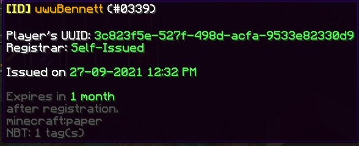
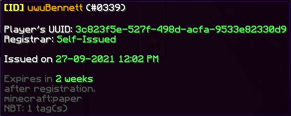

 

# Player Profiles

Descriptive profiles and identifications for players.

### Commands

Arguments in `<>` are required, while those that are in `[]` are optional.

- `/ppf register <playerName> [duration]`:
  Issues an ID for `playerName` that expires in `duration` after registration.
- `/ppf reload`: Reloads the config file and messages file.

### Permissions

| Permission | Description | Default | Children |
|---|---|:---:|:---:|
| ppf.register | Allows access to the `register` sub-command. | OP | None |
| ppf.reload | Allows access to the `reload` sub-command. | OP | None |

### Screenshots

ID Template

With `/pfp register uwuBennett` (since it defaults to 1 month):

With `/pfp register uwuBennett 2w`:

